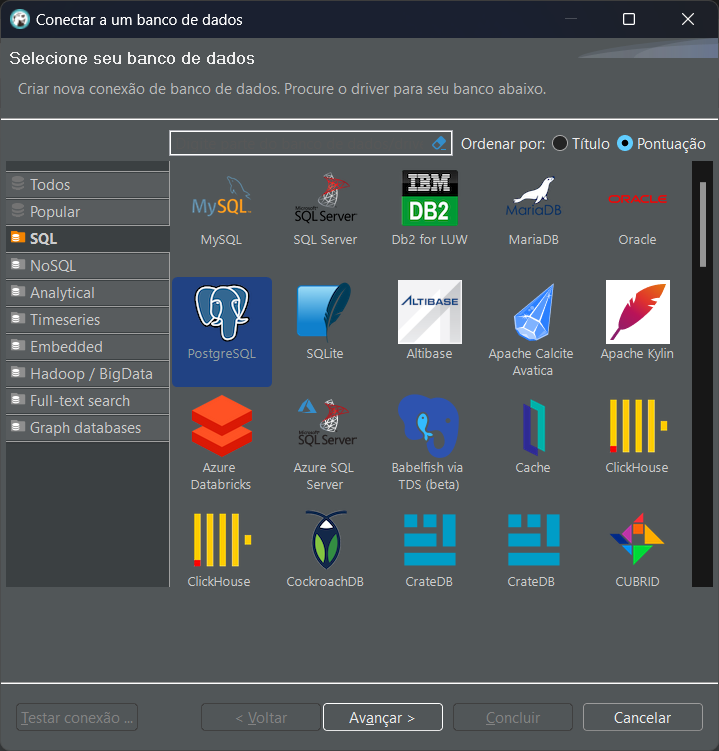

# scripts
Nesta pasta você encontra o necessário para subir um banco de dados SQL Server, MySQL e PostgreSQL usando Docker, além de dados de exemplo

## Pré-requisitos

* Docker instalado
* DBeaver para rodar os scripts e comandos

## Criação dos containers

Utilize os comandos abaixo para criar os containers no Docker para os bancos de dados:

### SQL Server

`docker run --name SQLServer -p 1433:1433 --hostname sql1 -e "ACCEPT_EULA=Y" -e "SA_PASSWORD=Minha@senha" -d mcr.microsoft.com/mssql/server:latest`

A porta configurada é a default para o SQL Server: 1433. Você pode mudar caso veja necessidade.

### MySQL

`docker run --name MySQL -p 3306:3306 -e MYSQL_ROOT_PASSWORD=Minha@senha -d mysql:latest`

A porta configurada é a default para o MySQL: 3306. Você pode mudar caso veja necessidade.

### PostgreSQL

`docker run --name PostgreSQL -p 5432:5432 -e POSTGRES_PASSWORD=Minha@senha -d postgres`

A porta configurada é a default para o PostgreSQL: 5432. Você pode mudar caso veja necessidade.

### DBeaver

Configure as conexões para os três bancos de dados. A vantagem do DBeaver é essa, você consegue utilizar vários bancos de dados distintos.

#### 1 - Abaixo um como configurar o SQL Server e executar o script de criação das tabelas de exemplo:

1.1) Clique no botão de `Nova conexão` (destacado em vermelho)

1.2) Clique na opção SQL Server e depois clique no botão `Avançar`

1.3) Pode manter todas as configurações padrão, somente na parte de autenticação indique o usuário `sa` e a senha `Minha@senha`, depois clique no botão `Concluir`

1.4) Expanda a árvore do banco de dados (pode ser que o DBeaver baixe um driver de conexão com o SQL Server se for a primeira vez) e clique com o botão direito do mouse em cima da pasta `Banco de dados`, depois clique na opção `Criar nova Banco de dados`

1.5) Digite `DBTeste` e clique no botão `OK`

1.6) Clique com o botão direito do mouse em cima do banco de dados `DBTeste`, depois vá na opção `Editor SQL` e clique na opção `Abrir script SQL`

1.7) Copie o conteúdo do arquivo `SQLServer_Script.sql` deste repositório e cole na janela de script que se abriu no DBeaver, certifique-se de que o banco de dados selecionado está o `DBTeste` (destacado em amarelo), selecione todo o script e depois clique no botão de `Executar script SQL` (destacado em vermelho)

1.8) Se tudo deu certo, o script foi executado com sucesso e haverão 124.780 linhas na tabela de Vendas

#### 2 - Abaixo um como configurar o MySQL e executar o script de criação das tabelas de exemplo:

2.1) Clique no botão de `Nova conexão` (destacado em vermelho)

2.2) Clique na opção MySQL e depois clique no botão `Avançar`

2.3) Pode manter todas as configurações padrão, somente na parte de autenticação indique a senha `Minha@senha`, depois clique no botão `Concluir`

2.4) Expanda a árvore do banco de dados (pode ser que o DBeaver baixe um driver de conexão com o MySQL se for a primeira vez) e clique com o botão direito do mouse em cima da pasta `Banco de dados`, depois clique na opção `Criar nova Banco de dados`.

2.5) Se der algum erro do tipo `Public Key Retrieval is not allowed`, clique com o botão direito do mouse na nova conexão e clique no item `Editar Conexão`, na aba `Driver properties` encontre a opção `allowPublicKeyRetrieval` e mude o valor para `TRUE`

2.6) Digite `DBTeste`, deixe as demais propriedades com os valores padrão e clique no botão `OK`

2.7) Clique com o botão direito do mouse em cima do banco de dados `DBTeste`, depois vá na opção `Editor SQL` e clique na opção `Abrir script SQL`

2.8) Copie o conteúdo do arquivo `MySQL_Script.sql` deste repositório e cole na janela de script que se abriu no DBeaver, certifique-se de que o banco de dados selecionado está o `DBTeste` (destacado em amarelo), selecione todo o script e depois clique no botão de `Executar script SQL` (destacado em vermelho)

2.9) Se tudo deu certo, o script foi executado com sucesso e haverão 124.780 linhas na tabela de Vendas

#### 3 - Abaixo um como configurar o PostgreSQL e executar o script de criação das tabelas de exemplo:

3.1) Clique no botão de `Nova conexão` (destacado em vermelho)

3.2) Clique na opção PostgreSQL e depois clique no botão `Avançar`

3.3) Pode manter todas as configurações padrão, somente na parte de autenticação indique a senha `Minha@senha`, depois clique no botão `Concluir`

3.4) Expanda a árvore do banco de dados e clique com o botão direito do mouse em cima da pasta `Banco de dados`, depois clique na opção `Criar nova Banco de dados`.

3.5) Digite `DBTeste`, deixe as demais propriedades com os valores padrão e clique no botão `OK`

3.6) Clique com o botão direito do mouse em cima do banco de dados `DBTeste`, depois vá na opção `Editor SQL` e clique na opção `Abrir script SQL`

3.7) Copie o conteúdo do arquivo `PostgreSQL_Script.sql` deste repositório e cole na janela de script que se abriu no DBeaver, certifique-se de que o banco de dados selecionado está o `DBTeste` (destacado em amarelo), selecione todo o script e depois clique no botão de `Executar instrução SQL` (destacado em vermelho)

3.8) Se tudo deu certo, o script foi executado com sucesso e haverão 124.780 linhas na tabela de Vendas

#### Pronto! Encerramos a configuração dos 3 bancos de dados para nosso estudo, agora vá para os códigos-fonte deste repositório para olharos as diferenças.